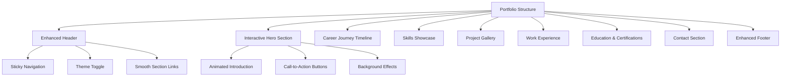
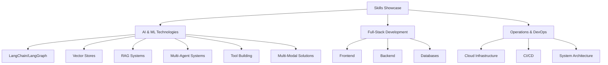
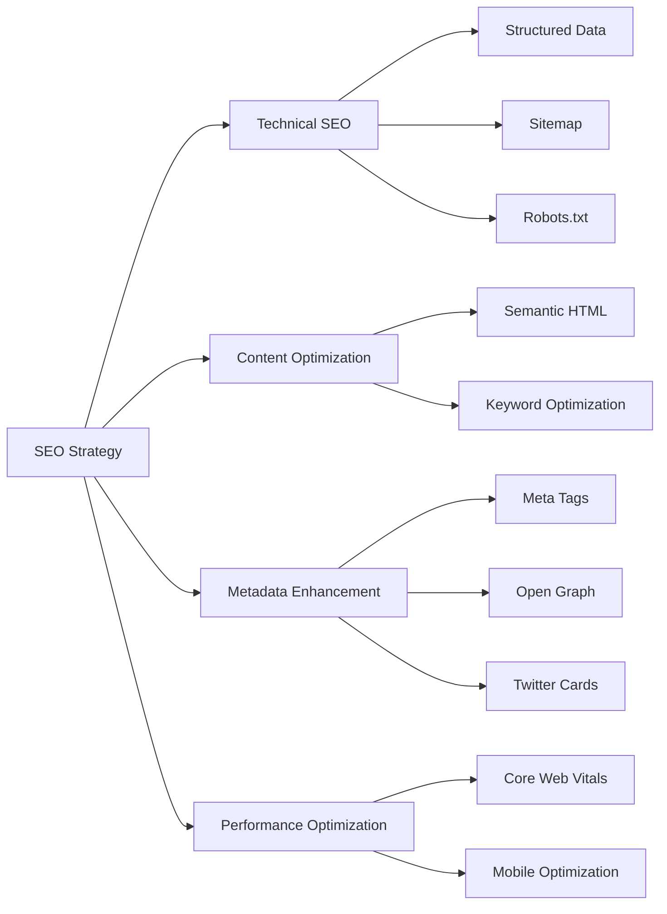
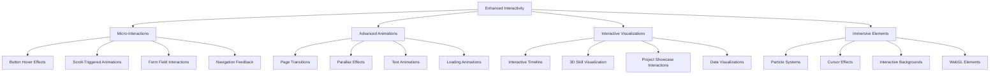

# Portfolio Website Enhancement Plan

## Overview

This plan outlines the comprehensive enhancement of a portfolio website for a software engineer with a background in operations who transitioned to full-stack development and is now specializing in AI solutions and langgraph applications.

## Design Direction

- **Style**: Clean and minimalist with a professional yet engaging aesthetic
- **Color Scheme**: Base neutral palette with blue and yellow accent colors
- **Themes**: Light/dark mode toggle functionality
- **Typography**: Clean, readable fonts with clear hierarchy
- **Animations**: Purposeful animations that enhance the experience

## Structural Enhancements

### Core Layout & Navigation

### Visual & Interactive Elements

- **Animated Career Path**: Visual representation of progression from operations to full-stack to AI
- **Skills Visualization**: Interactive display of technical skills with emphasis on AI technologies
- **Project Cards**: Clean, interactive cards with hover effects and detailed modals
- **Scroll Animations**: Content that animates into view as you scroll
- **Particle Effects**: Subtle background particle animations that respond to mouse movement
- **3D Elements**: Tasteful 3D elements for key sections (especially AI-related)

## Content Sections

### Hero Section

- Professional introduction with animated text
- Clear value proposition highlighting unique career path
- Call-to-action buttons for key portfolio sections
- Subtle background animation

### About Me

- Professional bio with career journey narrative
- Personal philosophy and approach to technology
- Key achievements and career highlights
- Interactive timeline showing career progression

### Skills & Expertise

### Projects Showcase

- Filterable gallery of projects
- Detailed project cards with:
  - Project overview
  - Technologies used
  - Key challenges and solutions
  - Visual representations
  - Links to live demos/repositories
- Special highlighting for AI application projects

### Work Experience

- Interactive timeline of professional roles
- Detailed role descriptions showing progression
- Key responsibilities and achievements
- Skills developed in each position
- Visual indication of career progression

### Education & Certifications

- Academic background
- Professional certifications
- Continuing education
- Relevant courses and training

### Contact Section

- Professional contact form with validation
- Social media and professional network links
- Call to action for potential collaborations
- Availability status

## Technical Improvements

### Performance Optimization

- Lazy loading for images and components
- Code splitting for faster initial load
- Optimized asset delivery
- Responsive image handling

### Animation System

- Scroll-triggered animations
- Micro-interactions for UI elements
- Page transitions
- Loading states and skeleton screens

### Advanced Interactivity

- Interactive skill charts
- Filterable project gallery
- Theme switching with persistent preferences
- Smooth scrolling between sections

## SEO Enhancements

- **Structured Data**: Implement JSON-LD for personal information, projects, and skills
- **Enhanced Metadata**: Optimized titles, descriptions, and social sharing metadata
- **Semantic HTML**: Proper heading hierarchy and semantic elements
- **Image Optimization**: Compressed images with descriptive alt text
- **Performance Metrics**: Optimized Core Web Vitals for better search ranking

## Enhanced Interactive Elements & Animations

### Enhanced Micro-Interactions

- **Hover States**: Advanced hover effects for all interactive elements with subtle animations
- **Button Animations**: Custom animations for buttons that provide visual feedback
- **Scroll Indicators**: Interactive scroll indicators that respond to user movement
- **Form Interactions**: Animated form fields with validation feedback
- **Menu Transitions**: Smooth, animated menu transitions with staggered item reveals

### Advanced Animation System

- **Scroll-Triggered Animations**: More sophisticated animations triggered by scroll position
  - Staggered reveals for list items
  - Parallax effects for background elements
  - Progressive disclosure of content
  - Direction-aware animations based on scroll direction
- **Text Animations**: Dynamic text animations

  - Typewriter effects for key statements
  - Text scramble effects for transitions
  - Gradient text animations
  - Split text animations with staggered character reveals

- **SVG Animations**: Animated SVG elements throughout the site
  - Path animations for icons and illustrations
  - Morphing shapes and transitions
  - Interactive SVG elements that respond to user input
  - Data visualization animations

### Interactive Visualizations

- **3D Skill Cube**: Interactive 3D cube showing different skill categories that rotates on hover/click
- **Career Path Visualization**: Interactive timeline with animated transitions between career stages
- **Project Showcase**: Enhanced project cards with:

  - 3D tilt effects on hover
  - Animated previews
  - Interactive filtering with animated transitions
  - Modal expansions with detailed information

- **Technology Stack Visualization**: Interactive visualization of technology expertise
  - Animated connections between related technologies
  - Expandable nodes for detailed information
  - Filter controls to focus on specific categories

### Immersive Elements

- **Particle System Background**: Subtle particle animations that:

  - Respond to mouse movement
  - Connect to form network-like patterns
  - Represent data or skills in abstract ways
  - Change based on the section being viewed

- **Custom Cursor Effects**:

  - Context-aware cursor that changes based on what's being hovered
  - Trailing effects for cursor movement
  - Magnetic effects near interactive elements

- **WebGL Elements**: Tasteful 3D elements for key sections
  - 3D model of a brain or neural network for AI section
  - Interactive code visualization
  - Abstract representations of data structures

### Section-Specific Interactions

#### Enhanced Hero Section

- Animated background with subtle particle effects
- Dynamic text animations for name and title
- Interactive elements that respond to mouse movement
- Smooth scroll animations to guide users down

#### Skills Section

- Interactive skill graph with expandable nodes
- Animated progress indicators
- Category filtering with smooth transitions
- Skill comparison functionality

#### Projects Section

- 3D card grid with perspective effects
- Interactive filtering system with animated transitions
- Preview animations on hover
- Detailed project modals with animated content

#### Career Timeline

- Interactive timeline with animated progression
- Expandable career milestones
- Animated transitions between roles
- Visual indicators of skill acquisition

## Technical Implementation Approach

### Animation Libraries & Technologies

- GSAP (GreenSock Animation Platform) for complex animations
- Three.js for 3D elements
- Svelte's built-in transitions with custom easing
- Intersection Observer API for scroll-triggered animations

### Performance Optimization

- Lazy loading for animations
- Use requestAnimationFrame for smooth animations
- Throttle event listeners for performance
- Conditionally load heavier animations based on device capability

### Progressive Enhancement

- Design core functionality to work without animations
- Layer animations on top of base functionality
- Provide reduced motion options for accessibility

### Component Architecture

- Create reusable animation components
- Implement animation hooks for consistent behavior
- Develop a central animation controller for coordinated effects

## Implementation Plan

### Phase 1: Foundation & Design System

1. Update Tailwind and DaisyUI configuration for new color scheme
2. Create theme toggle functionality
3. Develop reusable UI components
4. Implement base animations and transitions

### Phase 2: Core Sections & Layout

1. Enhance header and navigation
2. Rebuild hero section with animations
3. Create career journey timeline
4. Develop skills visualization components
5. Build project showcase with filtering

### Phase 3: Enhanced Features & Content

1. Implement all content templates
2. Add interactive elements and animations
3. Create advanced visualizations for skills and experience
4. Develop contact form with validation

### Phase 4: SEO & Optimization

1. Implement all SEO enhancements
2. Optimize performance and loading
3. Add structured data
4. Test and refine responsive behavior

## Key Components to Develop

1. **Theme Switcher**: Toggle between light and dark modes with persistent preference
2. **Career Timeline**: Interactive visualization of career progression
3. **Skills Visualization**: Dynamic representation of technical skills
4. **Project Cards**: Interactive project showcase with filtering
5. **Animated Sections**: Scroll-triggered animations for content sections
6. **SEO Component**: Centralized management of meta tags and structured data
7. **Animation Controllers**: Reusable animation components and hooks
8. **Interactive Backgrounds**: Particle systems and responsive elements
