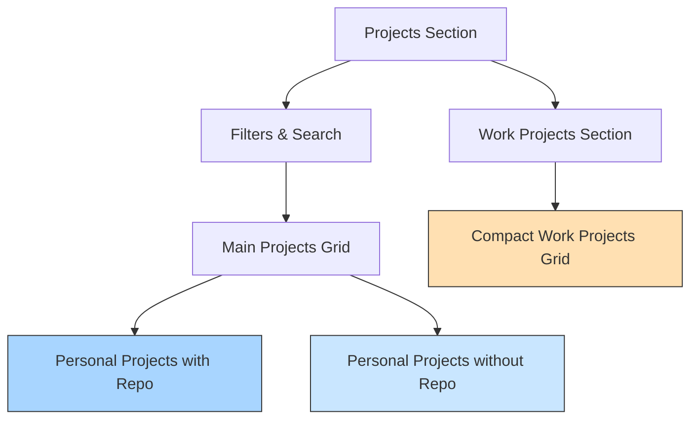

# Projects Section Implementation Plan

## Overview

This document outlines the implementation plan for reorganizing the Projects section of the personal website. The goal is to showcase different types of projects while maintaining visual appeal and existing filtering functionality.

## Project Types

We'll organize projects into three distinct categories:

1. **Featured Personal Projects with Repo Links (~3)**

   - Will have a "Code" button linking to the repository
   - Will maintain hover animations and interactive elements
   - Will be prominently displayed in the main grid

2. **Personal Projects without Repo Links (~3)**

   - No buttons or interactive elements on hover
   - Still visually appealing but with reduced interactivity
   - Will be displayed in the main grid alongside featured projects

3. **Work Projects (~6)**
   - Displayed in a separate section below the main projects
   - Compact layout (smaller cards in a grid format)
   - "Work Project" badge for clear identification
   - No buttons or interactive elements
   - Still filterable with the same logic as personal projects

## Implementation Steps

### 1. Update Project Data Structure

Modify the project data structure to include a new `type` field and update URL fields:

```javascript
const projects = [
	// Personal projects with repo links
	{
		title: 'Gatsby - Local Voice Assistant',
		description: 'A fully local voice assistant using LangGraph and Ollama for inference...',
		image: 'https://placehold.co/600x400/3498db/ffffff?text=Gatsby+Assistant',
		tags: ['LangGraph', 'Ollama', 'Whisper', 'FastAPI', 'Docker'],
		category: 'AI',
		featured: true,
		type: 'personal-with-repo',
		repoUrl: 'https://github.com/yourusername/gatsby-assistant'
	},
	// More personal projects with repos...

	// Personal projects without repo links
	{
		title: 'Project Title',
		description: 'Project description...',
		image: 'image-url',
		tags: ['Tag1', 'Tag2'],
		category: 'Category',
		featured: false,
		type: 'personal'
	},
	// More personal projects without repos...

	// Work projects
	{
		title: 'Work Project Title',
		description: 'Work project description...',
		image: 'image-url',
		tags: ['Tag1', 'Tag2'],
		category: 'Category',
		featured: false,
		type: 'work'
	}
	// More work projects...
];
```

### 2. Update Filtering Logic

Enhance the filtering logic to handle the new project types while maintaining the current behavior:

```javascript
// Sorted projects based on filter and search
$: sortedPersonalProjects = [...projects]
	.filter((project) => project.type !== 'work')
	.sort((a, b) => {
		const aMatches =
			(activeFilter === 'All' || a.category === activeFilter) &&
			(searchQuery === '' ||
				a.title.toLowerCase().includes(searchQuery.toLowerCase()) ||
				a.description.toLowerCase().includes(searchQuery.toLowerCase()) ||
				a.tags.some((tag) => tag.toLowerCase().includes(searchQuery.toLowerCase())));

		const bMatches =
			(activeFilter === 'All' || b.category === activeFilter) &&
			(searchQuery === '' ||
				b.title.toLowerCase().includes(searchQuery.toLowerCase()) ||
				b.description.toLowerCase().includes(searchQuery.toLowerCase()) ||
				b.tags.some((tag) => tag.toLowerCase().includes(searchQuery.toLowerCase())));

		if (aMatches && !bMatches) {
			return -1; // a comes first
		}
		if (!aMatches && bMatches) {
			return 1; // b comes first
		}
		return 0; // Maintain original relative order if both match or both don't
	});

$: sortedWorkProjects = [...projects]
	.filter((project) => project.type === 'work')
	.sort((a, b) => {
		const aMatches =
			(activeFilter === 'All' || a.category === activeFilter) &&
			(searchQuery === '' ||
				a.title.toLowerCase().includes(searchQuery.toLowerCase()) ||
				a.description.toLowerCase().includes(searchQuery.toLowerCase()) ||
				a.tags.some((tag) => tag.toLowerCase().includes(searchQuery.toLowerCase())));

		const bMatches =
			(activeFilter === 'All' || b.category === activeFilter) &&
			(searchQuery === '' ||
				b.title.toLowerCase().includes(searchQuery.toLowerCase()) ||
				b.description.toLowerCase().includes(searchQuery.toLowerCase()) ||
				b.tags.some((tag) => tag.toLowerCase().includes(searchQuery.toLowerCase())));

		if (aMatches && !bMatches) {
			return -1; // a comes first
		}
		if (!aMatches && bMatches) {
			return 1; // b comes first
		}
		return 0; // Maintain original relative order if both match or both don't
	});
```

### 3. Update HTML Structure

Modify the HTML structure to include separate sections for personal and work projects:

```html
<!-- Projects grid -->
{#if visible}
  <!-- Personal Projects Section -->
  <div
    class="grid grid-cols-1 md:grid-cols-2 lg:grid-cols-3 gap-8"
    use:staggerChildren={{ selector: '.project-card', staggerTime: 150 }}
  >
    {#each sortedPersonalProjects as project, i (project.title)}
      {@const matches =
        (activeFilter === 'All' || project.category === activeFilter) &&
        (searchQuery === '' ||
          project.title.toLowerCase().includes(searchQuery.toLowerCase()) ||
          project.description.toLowerCase().includes(searchQuery.toLowerCase()) ||
          project.tags.some((tag) => tag.toLowerCase().includes(searchQuery.toLowerCase())))}
      <div
        class="project-card card group bg-base-100 shadow-xl overflow-hidden h-full flex flex-col transition-all duration-500"
        class:card-hover={matches && project.type === 'personal-with-repo'}
        class:blur-sm={!matches}
        class:opacity-60={!matches}
        animate:flip={{ duration: 500 }}
      >
        <!-- Project image -->
        <figure class="relative">
          

          {#if project.featured}
            <div class="absolute top-2 right-2 badge badge-primary">Featured</div>
          {/if}

          {#if project.type === 'personal-with-repo' && matches}
            <div
              class="absolute inset-0 bg-gradient-to-t from-base-300 to-transparent opacity-0 transition-opacity duration-300 flex items-end justify-center p-4"
              class:group-hover:opacity-100={matches}
            >
              <div class="flex gap-2">
                <a
                  href={project.repoUrl}
                  class="btn btn-sm btn-outline"
                  target="_blank"
                  rel="noopener noreferrer"
                >
                  <svg
                    xmlns="http://www.w3.org/2000/svg"
                    class="h-4 w-4 mr-1"
                    fill="none"
                    viewBox="0 0 24 24"
                    stroke="currentColor"
                  >
                    <path
                      stroke-linecap="round"
                      stroke-linejoin="round"
                      stroke-width="2"
                      d="M10 20l4-16m4 4l4 4-4 4M6 16l-4-4 4-4"
                    />
                  </svg>
                  Code
                </a>
              </div>
            </div>
          {/if}
        </figure>
        <!-- Project content -->
        <div class="card-body flex flex-col flex-grow py-6">
          <div class="mb-3">
            <div class="flex flex-col">
              <div class="flex items-center justify-between mb-1">
                <h3 class="card-title text-lg">{project.title}</h3>
                <div class="badge badge-secondary whitespace-nowrap ml-2">
                  {project.category}
                </div>
              </div>
            </div>
          </div>

          <p class="text-sm opacity-80 line-clamp-3 flex-grow">{project.description}</p>

          <!-- Tags -->
          <div class="card-actions justify-start mt-auto pt-4 flex-wrap gap-2">
            {#each project.tags as tag}
              <div class="badge badge-outline">{tag}</div>
            {/each}
          </div>
        </div>
      </div>
    {/each}
  </div>

  <!-- Work Projects Section -->
  {#if sortedWorkProjects.length > 0}
    <div class="mt-20">
      <h3 class="text-2xl font-bold mb-6 text-center">Work Experience</h3>
      <div
        class="grid grid-cols-2 md:grid-cols-3 lg:grid-cols-4 gap-4"
        use:staggerChildren={{ selector: '.work-project-card', staggerTime: 100 }}
      >
        {#each sortedWorkProjects as project, i (project.title)}
          {@const matches =
            (activeFilter === 'All' || project.category === activeFilter) &&
            (searchQuery === '' ||
              project.title.toLowerCase().includes(searchQuery.toLowerCase()) ||
              project.description.toLowerCase().includes(searchQuery.toLowerCase()) ||
              project.tags.some((tag) => tag.toLowerCase().includes(searchQuery.toLowerCase())))}
          <div
            class="work-project-card card bg-base-100 shadow-md overflow-hidden flex flex-col transition-all duration-500"
            class:blur-sm={!matches}
            class:opacity-60={!matches}
            animate:flip={{ duration: 500 }}
          >
            <!-- Project image -->
            <figure class="relative">
              
              <div class="absolute top-2 right-2 badge badge-accent badge-sm">Work</div>
            </figure>
            <!-- Project content -->
            <div class="card-body p-4">
              <div class="mb-2">
                <div class="flex flex-col">
                  <div class="flex items-center justify-between mb-1">
                    <h3 class="card-title text-sm">{project.title}</h3>
                  </div>
                </div>
              </div>

              <p class="text-xs opacity-80 line-clamp-2">{project.description}</p>

              <!-- Tags - limited to 3 -->
              <div class="card-actions justify-start mt-2 flex-wrap gap-1">
                {#each project.tags.slice(0, 3) as tag}
                  <div class="badge badge-outline badge-sm">{tag}</div>
                {/each}
              </div>
            </div>
          </div>
        {/each}
      </div>
    </div>
  {/if}
{/if}
```

### 4. Update CSS Styles

Add styles for the new work project cards:

```css
.project-card {
	transition:
		transform 0.3s ease,
		box-shadow 0.3s ease;
	display: flex;
	flex-direction: column;
	min-height: 500px; /* Minimum height for the card */
}

.project-card:not(.opacity-60):hover {
	transform: translateY(-5px);
	box-shadow:
		0 20px 25px -5px rgba(0, 0, 0, 0.1),
		0 10px 10px -5px rgba(0, 0, 0, 0.04);
}

.line-clamp-3 {
	display: -webkit-box;
	-webkit-line-clamp: 3;
	-webkit-box-orient: vertical;
	overflow: hidden;
	min-height: 6rem; /* Increased height for description area */
}

.work-project-card {
	transition: all 0.3s ease;
	display: flex;
	flex-direction: column;
	min-height: 250px; /* Smaller minimum height for work cards */
}

.line-clamp-2 {
	display: -webkit-box;
	-webkit-line-clamp: 2;
	-webkit-box-orient: vertical;
	overflow: hidden;
	min-height: 2.5rem;
}
```

## Visual Layout



## Sample Project Data

Here's a sample of how the project data should be structured:

```javascript
const projects = [
	// Personal projects with repo links
	{
		title: 'Gatsby - Local Voice Assistant',
		description: 'A fully local voice assistant using LangGraph and Ollama for inference...',
		image: 'https://placehold.co/600x400/3498db/ffffff?text=Gatsby+Assistant',
		tags: ['LangGraph', 'Ollama', 'Whisper', 'FastAPI', 'Docker'],
		category: 'AI',
		featured: true,
		type: 'personal-with-repo',
		repoUrl: 'https://github.com/yourusername/gatsby-assistant'
	},
	{
		title: 'Dealer Assistant Chatbot',
		description: 'Enhanced a customer-facing chatbot with image input capabilities...',
		image: 'https://placehold.co/600x400/9b59b6/ffffff?text=Dealer+Assistant',
		tags: ['LangChain', 'OpenAI', 'RAG', 'Images', 'CDP'],
		category: 'AI',
		featured: true,
		type: 'personal-with-repo',
		repoUrl: 'https://github.com/yourusername/dealer-assistant'
	},
	{
		title: 'GitHub Bot (Francois)',
		description: 'Developed an AI-enabled GitHub bot to monitor and respond to failing runners...',
		image: 'https://placehold.co/600x400/e74c3c/ffffff?text=GitHub+Bot',
		tags: ['GitHub API', 'AI', 'CI/CD', 'Python'],
		category: 'DevOps',
		featured: true,
		type: 'personal-with-repo',
		repoUrl: 'https://github.com/yourusername/github-bot'
	},

	// Personal projects without repo links
	{
		title: 'AI Research Project',
		description: 'Conducted research on advanced natural language processing techniques...',
		image: 'https://placehold.co/600x400/1abc9c/ffffff?text=AI+Research',
		tags: ['NLP', 'Research', 'Machine Learning'],
		category: 'AI',
		featured: false,
		type: 'personal'
	},
	{
		title: 'Security Framework',
		description: 'Developed a comprehensive security framework for web applications...',
		image: 'https://placehold.co/600x400/2ecc71/ffffff?text=Security+Framework',
		tags: ['Security', 'Web', 'Framework'],
		category: 'Security',
		featured: false,
		type: 'personal'
	},
	{
		title: 'DevOps Pipeline',
		description: 'Created an end-to-end CI/CD pipeline for automated testing and deployment...',
		image: 'https://placehold.co/600x400/f39c12/ffffff?text=DevOps+Pipeline',
		tags: ['CI/CD', 'Automation', 'Testing'],
		category: 'DevOps',
		featured: false,
		type: 'personal'
	},

	// Work projects
	{
		title: 'CSRF Protection Implementation',
		description:
			'Implemented a global application design change to protect against identified security flaws...',
		image: 'https://placehold.co/600x400/2ecc71/ffffff?text=Security+Project',
		tags: ['Security', 'CSRF', 'Java', 'Spring'],
		category: 'Security',
		featured: false,
		type: 'work'
	},
	{
		title: 'Server Startup Test',
		description:
			'Developed a CI process to containerize pull requests and test application startup...',
		image: 'https://placehold.co/600x400/f39c12/ffffff?text=Server+Test',
		tags: ['AWS', 'CI/CD', 'Docker', 'Boto3', 'ECS'],
		category: 'DevOps',
		featured: false,
		type: 'work'
	},
	{
		title: 'XML File S3 Replication',
		description: 'Used Terraform to create resilient S3 buckets across multiple AWS regions...',
		image: 'https://placehold.co/600x400/1abc9c/ffffff?text=S3+Replication',
		tags: ['AWS', 'Terraform', 'IAM', 'GitHub Actions', 'S3'],
		category: 'DevOps',
		featured: false,
		type: 'work'
	},
	{
		title: 'API Gateway Implementation',
		description: 'Designed and implemented an API Gateway for microservices architecture...',
		image: 'https://placehold.co/600x400/3498db/ffffff?text=API+Gateway',
		tags: ['Microservices', 'API', 'Gateway'],
		category: 'DevOps',
		featured: false,
		type: 'work'
	},
	{
		title: 'Database Migration Tool',
		description: 'Created a tool for seamless database migrations between environments...',
		image: 'https://placehold.co/600x400/9b59b6/ffffff?text=DB+Migration',
		tags: ['Database', 'Migration', 'Tool'],
		category: 'DevOps',
		featured: false,
		type: 'work'
	},
	{
		title: 'Security Audit System',
		description: 'Developed an automated security audit system for compliance monitoring...',
		image: 'https://placehold.co/600x400/e74c3c/ffffff?text=Security+Audit',
		tags: ['Security', 'Audit', 'Compliance'],
		category: 'Security',
		featured: false,
		type: 'work'
	}
];
```

## Next Steps

1. Update the Projects.svelte file with the new data structure and components
2. Test the filtering functionality across both personal and work projects
3. Adjust styling as needed to ensure visual consistency
4. Ensure responsive behavior works correctly on all screen sizes
